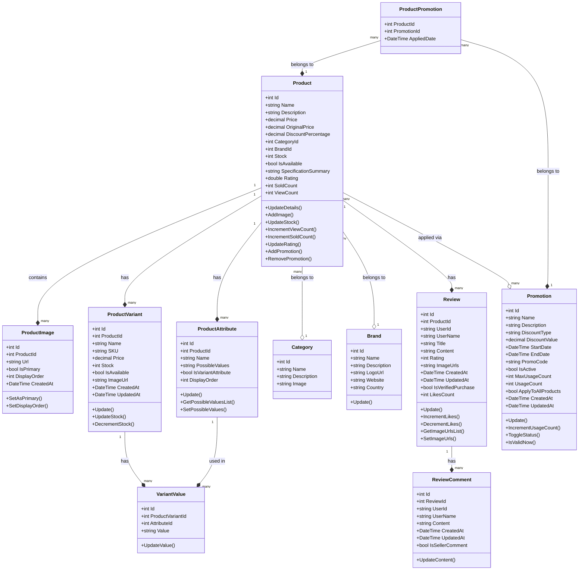

# Thiết Kế Cơ Sở Dữ Liệu Product.API

## Tổng Quan

Cơ sở dữ liệu của Product.API được thiết kế để lưu trữ và quản lý tất cả thông tin liên quan đến sản phẩm trong hệ thống thương mại điện tử giống Shopee. Thiết kế này tập trung vào tính linh hoạt, hiệu suất và khả năng mở rộng.

## Mô Hình Cơ Sở Dữ Liệu

## Chi Tiết Các Bảng

### Product (Sản phẩm)

Bảng chính lưu trữ thông tin cơ bản về sản phẩm.

| Trường               | Kiểu dữ liệu | Mô tả                                  |
| -------------------- | ------------ | -------------------------------------- |
| Id                   | int          | Khóa chính, ID của sản phẩm            |
| Name                 | string(200)  | Tên sản phẩm                           |
| Description          | string(2000) | Mô tả chi tiết về sản phẩm             |
| Price                | decimal      | Giá hiện tại của sản phẩm              |
| OriginalPrice        | decimal      | Giá gốc trước khi giảm giá             |
| DiscountPercentage   | decimal      | Phần trăm giảm giá                     |
| CategoryId           | int          | Khóa ngoại tới bảng Category           |
| BrandId              | int          | Khóa ngoại tới bảng Brand              |
| Stock                | int          | Số lượng tồn kho                       |
| IsAvailable          | bool         | Trạng thái sẵn có của sản phẩm         |
| SpecificationSummary | string(500)  | Tóm tắt thông số kỹ thuật              |
| Rating               | double       | Đánh giá trung bình của sản phẩm (1-5) |
| SoldCount            | int          | Số lượng đã bán                        |
| ViewCount            | int          | Số lượt xem                            |

### ProductImage (Hình ảnh sản phẩm)

Lưu trữ thông tin về các hình ảnh của sản phẩm.

| Trường       | Kiểu dữ liệu | Mô tả                          |
| ------------ | ------------ | ------------------------------ |
| Id           | int          | Khóa chính, ID của hình ảnh    |
| ProductId    | int          | Khóa ngoại tới bảng Product    |
| Url          | string(500)  | URL của hình ảnh               |
| IsPrimary    | bool         | Đánh dấu đây là hình ảnh chính |
| DisplayOrder | int          | Thứ tự hiển thị của hình ảnh   |
| CreatedAt    | DateTime     | Ngày tạo hình ảnh              |

### ProductVariant (Biến thể sản phẩm)

Lưu trữ thông tin về các biến thể của sản phẩm (màu sắc, kích cỡ, v.v.)

| Trường      | Kiểu dữ liệu | Mô tả                            |
| ----------- | ------------ | -------------------------------- |
| Id          | int          | Khóa chính, ID của biến thể      |
| ProductId   | int          | Khóa ngoại tới bảng Product      |
| Name        | string(200)  | Tên biến thể (ví dụ: "XL - Đỏ")  |
| SKU         | string(50)   | Mã quản lý hàng hóa của biến thể |
| Price       | decimal      | Giá của biến thể                 |
| Stock       | int          | Số lượng tồn kho của biến thể    |
| IsAvailable | bool         | Trạng thái sẵn có của biến thể   |
| ImageUrl    | string(500)  | URL hình ảnh của biến thể        |
| CreatedAt   | DateTime     | Ngày tạo biến thể                |
| UpdatedAt   | DateTime     | Ngày cập nhật biến thể           |

### ProductAttribute (Thuộc tính sản phẩm)

Lưu trữ thông tin về các thuộc tính của sản phẩm.

| Trường             | Kiểu dữ liệu | Mô tả                                                |
| ------------------ | ------------ | ---------------------------------------------------- |
| Id                 | int          | Khóa chính, ID của thuộc tính                        |
| ProductId          | int          | Khóa ngoại tới bảng Product                          |
| Name               | string(100)  | Tên thuộc tính (ví dụ: "Màu sắc")                    |
| PossibleValues     | string(500)  | Các giá trị có thể có của thuộc tính                 |
| IsVariantAttribute | bool         | Thuộc tính này có được sử dụng để tạo biến thể không |
| DisplayOrder       | int          | Thứ tự hiển thị của thuộc tính                       |

### VariantValue (Giá trị thuộc tính biến thể)

Bảng liên kết giữa biến thể và thuộc tính, lưu giá trị cụ thể.

| Trường           | Kiểu dữ liệu | Mô tả                                       |
| ---------------- | ------------ | ------------------------------------------- |
| Id               | int          | Khóa chính, ID của giá trị                  |
| ProductVariantId | int          | Khóa ngoại tới bảng ProductVariant          |
| AttributeId      | int          | Khóa ngoại tới bảng ProductAttribute        |
| Value            | string(100)  | Giá trị cụ thể của thuộc tính (ví dụ: "Đỏ") |

### Category (Danh mục)

Lưu trữ thông tin về các danh mục sản phẩm.

| Trường      | Kiểu dữ liệu | Mô tả                              |
| ----------- | ------------ | ---------------------------------- |
| Id          | int          | Khóa chính, ID của danh mục        |
| Name        | string       | Tên danh mục                       |
| Description | string       | Mô tả danh mục                     |
| Image       | string       | URL hình ảnh đại diện cho danh mục |

### Brand (Thương hiệu)

Lưu trữ thông tin về các thương hiệu.

| Trường      | Kiểu dữ liệu | Mô tả                                |
| ----------- | ------------ | ------------------------------------ |
| Id          | int          | Khóa chính, ID của thương hiệu       |
| Name        | string(100)  | Tên thương hiệu                      |
| Description | string(1000) | Mô tả về thương hiệu                 |
| LogoUrl     | string(255)  | URL logo của thương hiệu             |
| Website     | string(255)  | Trang web chính thức của thương hiệu |
| Country     | string(100)  | Quốc gia xuất xứ                     |

### Review (Đánh giá)

Lưu trữ thông tin đánh giá sản phẩm từ người dùng.

| Trường             | Kiểu dữ liệu | Mô tả                                        |
| ------------------ | ------------ | -------------------------------------------- |
| Id                 | int          | Khóa chính, ID của đánh giá                  |
| ProductId          | int          | Khóa ngoại tới bảng Product                  |
| UserId             | string       | ID của người dùng đánh giá                   |
| UserName           | string(100)  | Tên người dùng đánh giá                      |
| Title              | string(200)  | Tiêu đề đánh giá                             |
| Content            | string(2000) | Nội dung đánh giá                            |
| Rating             | int          | Số sao đánh giá (1-5)                        |
| ImageUrls          | string(1000) | Danh sách URL hình ảnh đính kèm với đánh giá |
| CreatedAt          | DateTime     | Ngày tạo đánh giá                            |
| UpdatedAt          | DateTime     | Ngày cập nhật đánh giá                       |
| IsVerifiedPurchase | bool         | Xác nhận người dùng đã mua sản phẩm          |
| LikesCount         | int          | Số lượt thích cho đánh giá này               |

### ReviewComment (Phản hồi đánh giá)

Lưu trữ thông tin phản hồi cho đánh giá.

| Trường          | Kiểu dữ liệu | Mô tả                                 |
| --------------- | ------------ | ------------------------------------- |
| Id              | int          | Khóa chính, ID của phản hồi           |
| ReviewId        | int          | Khóa ngoại tới bảng Review            |
| UserId          | string       | ID của người dùng viết phản hồi       |
| UserName        | string(100)  | Tên người dùng viết phản hồi          |
| Content         | string(1000) | Nội dung phản hồi                     |
| CreatedAt       | DateTime     | Ngày tạo phản hồi                     |
| UpdatedAt       | DateTime     | Ngày cập nhật phản hồi                |
| IsSellerComment | bool         | Đánh dấu đây là phản hồi từ người bán |

### Promotion (Khuyến mãi)

Lưu trữ thông tin về các chương trình khuyến mãi.

| Trường             | Kiểu dữ liệu | Mô tả                                     |
| ------------------ | ------------ | ----------------------------------------- |
| Id                 | int          | Khóa chính, ID của khuyến mãi             |
| Name               | string(200)  | Tên khuyến mãi                            |
| Description        | string(1000) | Mô tả khuyến mãi                          |
| DiscountType       | string(20)   | Loại khuyến mãi (Percentage, FixedAmount) |
| DiscountValue      | decimal      | Giá trị khuyến mãi                        |
| StartDate          | DateTime     | Ngày bắt đầu khuyến mãi                   |
| EndDate            | DateTime     | Ngày kết thúc khuyến mãi                  |
| PromoCode          | string(50)   | Mã khuyến mãi (nếu có)                    |
| IsActive           | bool         | Trạng thái hoạt động                      |
| MaxUsageCount      | int          | Số lượng tối đa có thể sử dụng            |
| UsageCount         | int          | Số lượng đã sử dụng                       |
| ApplyToAllProducts | bool         | Áp dụng cho tất cả sản phẩm               |
| CreatedAt          | DateTime     | Ngày tạo khuyến mãi                       |
| UpdatedAt          | DateTime     | Ngày cập nhật khuyến mãi                  |

### ProductPromotion (Liên kết Sản phẩm - Khuyến mãi)

Bảng liên kết giữa sản phẩm và khuyến mãi.

| Trường      | Kiểu dữ liệu | Mô tả                                     |
| ----------- | ------------ | ----------------------------------------- |
| ProductId   | int          | Khóa chính, khóa ngoại tới bảng Product   |
| PromotionId | int          | Khóa chính, khóa ngoại tới bảng Promotion |
| AppliedDate | DateTime     | Ngày áp dụng khuyến mãi cho sản phẩm      |

## Quan Hệ Giữa Các Bảng

1. **Product - Category**: Mỗi sản phẩm thuộc về một danh mục (quan hệ nhiều-một)
2. **Product - Brand**: Mỗi sản phẩm thuộc về một thương hiệu (quan hệ nhiều-một)
3. **Product - ProductImage**: Mỗi sản phẩm có nhiều hình ảnh (quan hệ một-nhiều)
4. **Product - ProductVariant**: Mỗi sản phẩm có nhiều biến thể (quan hệ một-nhiều)
5. **Product - ProductAttribute**: Mỗi sản phẩm có nhiều thuộc tính (quan hệ một-nhiều)
6. **ProductVariant - VariantValue**: Mỗi biến thể có nhiều giá trị thuộc tính (quan hệ một-nhiều)
7. **ProductAttribute - VariantValue**: Mỗi thuộc tính được sử dụng trong nhiều giá trị biến thể (quan hệ một-nhiều)
8. **Product - Review**: Mỗi sản phẩm có nhiều đánh giá (quan hệ một-nhiều)
9. **Review - ReviewComment**: Mỗi đánh giá có nhiều phản hồi (quan hệ một-nhiều)
10. **Product - Promotion**: Mỗi sản phẩm được áp dụng nhiều khuyến mãi và mỗi khuyến mãi có thể áp dụng cho nhiều sản phẩm (quan hệ nhiều-nhiều thông qua bảng ProductPromotion)

## Chỉ Mục (Indexes)

Để tối ưu hiệu suất truy vấn, một số chỉ mục quan trọng cần được tạo:

1. CategoryId trên bảng Product
2. BrandId trên bảng Product
3. ProductId trên bảng ProductImage, ProductVariant, ProductAttribute, Review
4. ReviewId trên bảng ReviewComment
5. ProductVariantId và AttributeId trên bảng VariantValue
6. ProductId và PromotionId trên bảng ProductPromotion
7. Name (với LIKE operator) trên bảng Product
8. Price, Rating, SoldCount trên bảng Product (cho các tính năng sắp xếp và lọc)

## Cân Nhắc Khi Thực Hiện

1. **Performance**: Cần cân nhắc đến việc sharding hoặc partitioning các bảng lớn như Product và Review
2. **Caching**: Các thông tin thường xuyên truy cập như danh sách sản phẩm, chi tiết sản phẩm nên được cache
3. **Soft Delete**: Nên sử dụng soft delete (thêm trường IsDeleted) thay vì xóa hoàn toàn dữ liệu
4. **Validation**: Cần có các ràng buộc và validation để đảm bảo tính nhất quán của dữ liệu
5. **Audit Trail**: Nên có cơ chế theo dõi các thay đổi quan trọng (ai đã thay đổi, thay đổi gì, khi nào)
