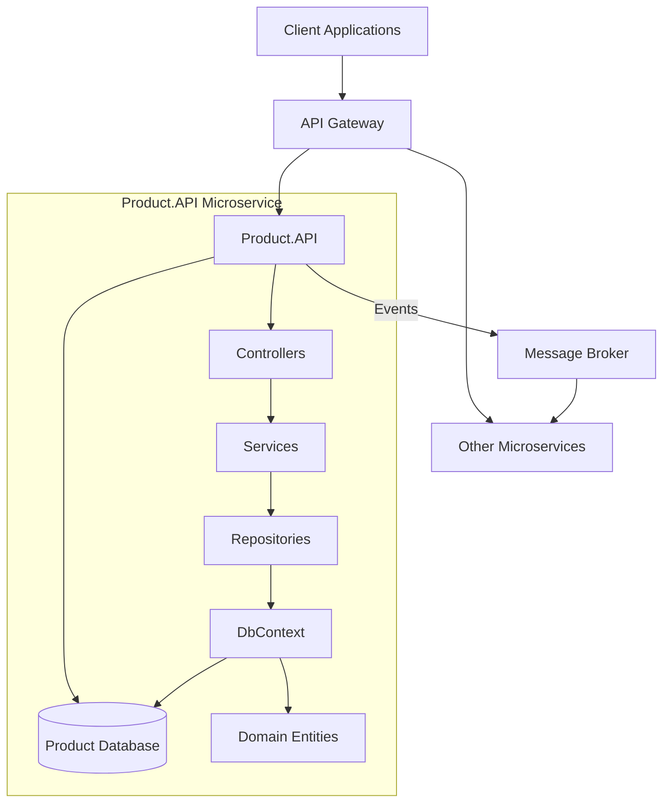
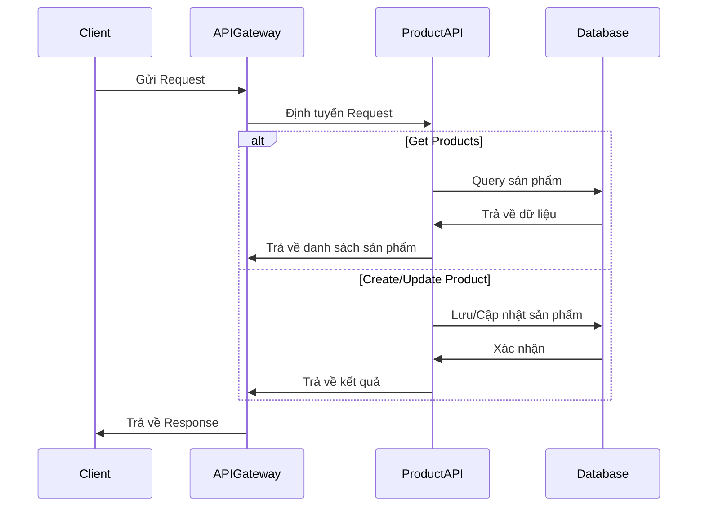
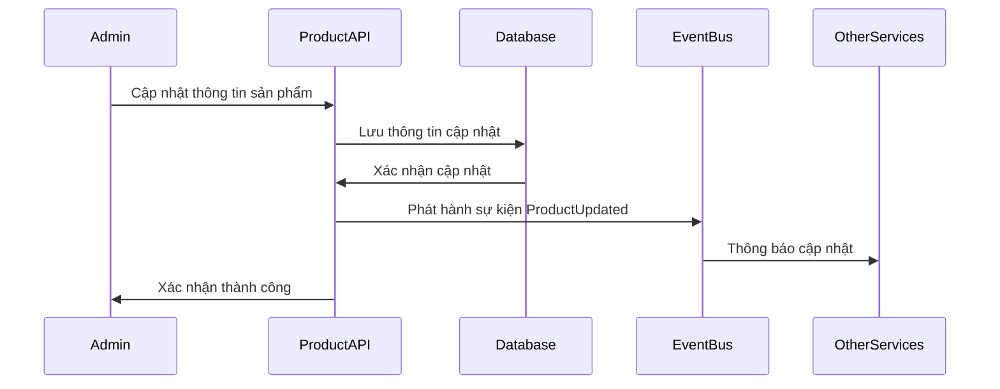
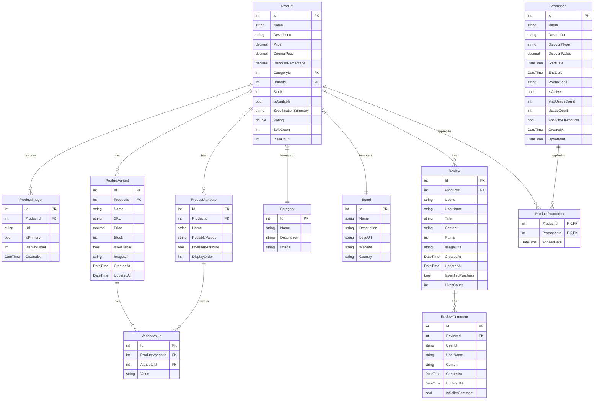

# Microservice Product.API

## Giới Thiệu

Product.API là một microservice chịu trách nhiệm quản lý toàn bộ thông tin liên quan đến sản phẩm trong hệ thống thương mại điện tử. Microservice này được thiết kế để hoạt động độc lập, có khả năng mở rộng cao và tương tác với các microservice khác thông qua API.

## Kiến Trúc Tổng Quan



## Luồng Xử Lý Chính

### Luồng Xử Lý Yêu Cầu API



### Luồng Cập Nhật Sản Phẩm



## Mô Hình Dữ Liệu



## Các Chức Năng Chính

1. **Quản lý sản phẩm**

   - Tạo, đọc, cập nhật, xóa sản phẩm
   - Quản lý biến thể sản phẩm (kích cỡ, màu sắc, etc.)
   - Quản lý thuộc tính sản phẩm

2. **Quản lý danh mục và thương hiệu**

   - Tạo, đọc, cập nhật, xóa danh mục
   - Tạo, đọc, cập nhật, xóa thương hiệu

3. **Quản lý đánh giá và phản hồi**

   - Tạo, đọc, cập nhật, xóa đánh giá
   - Quản lý phản hồi cho đánh giá

4. **Quản lý khuyến mãi**
   - Tạo, đọc, cập nhật, xóa khuyến mãi
   - Áp dụng khuyến mãi cho sản phẩm

## Công Nghệ Sử Dụng

- **Framework**: ASP.NET Core
- **ORM**: Entity Framework Core
- **Database**: SQL Server
- **Messaging**: RabbitMQ/Azure Service Bus (cho giao tiếp giữa các microservice)
- **API Documentation**: Swagger/OpenAPI

## Cấu Trúc Thư Mục

```
Product.API/
├── Domain/                # Domain layer - business entities
│   ├── Entities/          # Domain entities
│   └── Events/            # Domain events
├── Application/           # Application layer - use cases
│   ├── Commands/          # Commands (write operations)
│   ├── Queries/           # Queries (read operations)
│   └── DTOs/              # Data Transfer Objects
├── Infrastructure/        # Infrastructure layer
│   ├── Data/              # Database access
│   ├── Repositories/      # Repository implementations
│   └── Services/          # External services implementations
├── API/                   # API layer
│   ├── Controllers/       # API Controllers
│   └── Filters/           # API Filters
└── Extensions/            # Extension methods
```

## Deployment

Microservice này được thiết kế để triển khai trong container Docker và có thể được quản lý bằng Kubernetes. Các cấu hình môi trường được cung cấp qua file appsettings.json và biến môi trường.

## Hướng Phát Triển

1. Cải thiện hiệu suất truy vấn với Redis cache
2. Thêm tính năng tìm kiếm sản phẩm nâng cao với Elasticsearch
3. Tích hợp xử lý hàng loạt với background workers
4. Thêm tính năng thông báo thay đổi giá/tồn kho trong thời gian thực
